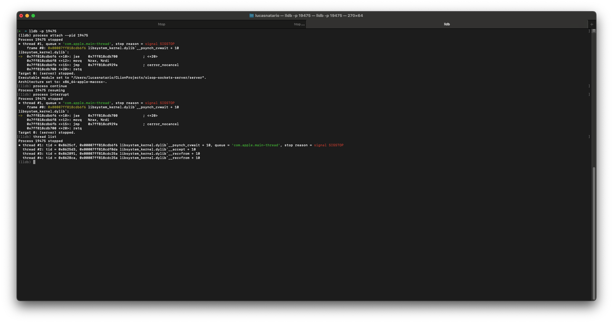
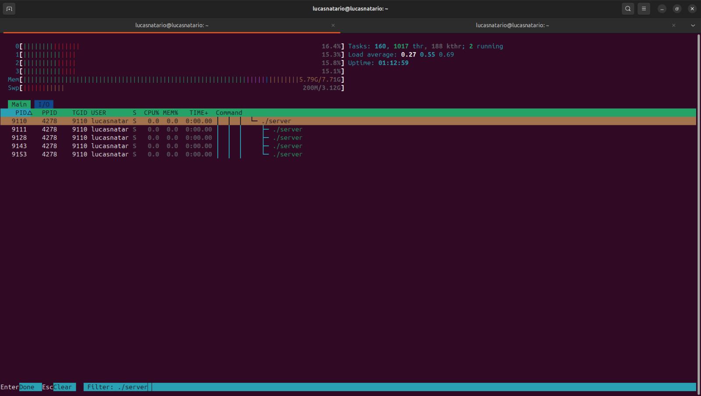

# Compilación
## Requisitos
### Cmake
- Para MacOS: `brew install cmake`
- Para Linux (Ubuntu) : `sudo apt install cmake`
### GCC
- Para MacOS: Viene nativo con XCode
- Para Linux (Ubuntu): `sudo apt install build-essential`
## Compilar y ejecutar
- En un terminal ejecutar `cmake . && make`
- Abrir el ejecutable en la misma carpeta del proyecto `./server`

# Monitoreo
## MacOS
- Para obtener el PID usar `htop`y buscar con `F3` el ejecutable `./server`
- Ejecutar `lldb -p <PID>`
  - Este comando hace attach de un nuevo hilo al proceso que recibe por parametro y lo bloquea para debug
  - Para dejarlo correr ejecutar `process continue`, aunque esto bloquea poder ejecutar los comandos de debug como `thread list`
  - Para frenar el proceso con el debugger devuelta usar `process interrupt`
- Dentro de `lldb` ejecutar `thread list`
  - Aca se podrá ver el `TID`, como MacOS no brinda una API desde C para obtener el `TID`, no se puede ver la correspondencia del `TID` desde el ejecutable para identificar a que conexión corresponde
- Salir de `lldb` con `quit`
  

## Linux
### HTOP
- Instalar con `sudo apt install htop`
- Ejecutar `htop`
- En `setup (F2)` activar las opciones
  - Display Options -> Tree view
  - Display Options -> Show custom thread names
- Con `filter (F4)` filtrar `./server` y se podrá ver en forma de arbol los hilos _(en verde)_ que contenga el proceso padre
